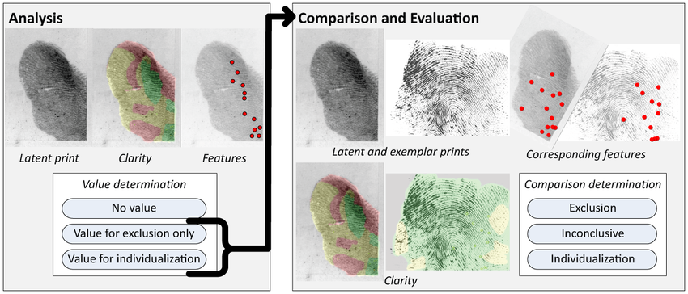

  The main focus of our research is using IRT-esque modeling to explore the [White Box Study][wbs]. In this study, latent print examiners use  their expertise to determine whether or not the information contained in two fingerprints (or palm prints) is enough to say that the two prints are a match (from the same person). They do this by looking at corresponding minutae (unique patterns in certain places in the print). However, this conclusion is not objective, yet it is what gets presented at court. The purpose of the White Box Study was to clarify what factors influence sufficiency for individualization (saying that two prints are a match) or an inconclusive decision.
  
```{r setup, include=FALSE}
knitr::opts_chunk$set(echo = FALSE)
library(knitr)
library(graphics)
library(bookdown)

# Learn more about creating websites with Distill at:
# https://rstudio.github.io/distill/website.html

# Learn more about publishing to GitHub Pages at:
# https://rstudio.github.io/distill/publish_website.html#github-pages

```

```{r, include=TRUE, fig.cap="Analysis, comparison, and evaluation stages in latent fingerprint examination. Source: https://www.researchgate.net/figure/Test-workflow-Each-examiner-was-assigned-a-distinct-randomized-sequence-of_fig1_267871219"}



```

Partway into this project, a friend asked why latent fingerprint examination was still done manually and why artificial intelligence has not been incorporated into the justice system in this way yet. Thus, I am particularly interested in characterizing the errors examiners make and seeing if there is any predictability in what kinds of prints examiners typically fail to determine correctly. In the future, I hope this can lead to some sort of neural networking algorithm that can at least semi-automate the examination process to rule out some of the subjectivity in the traditional procedure.

[wbs]: https://www.ncbi.nlm.nih.gov/pmc/articles/PMC4221158/pdf/pone.0110179.pdf "White Box Study paper"
